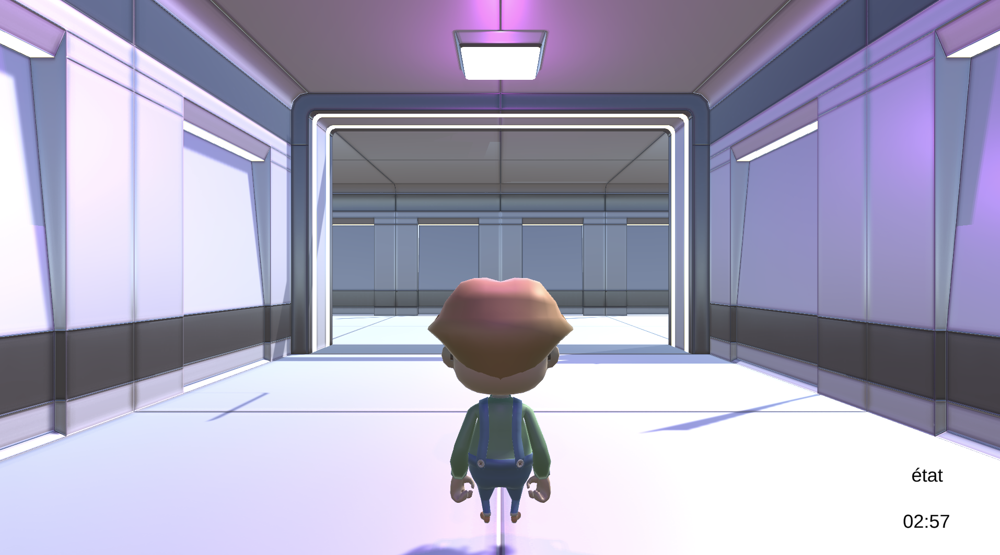
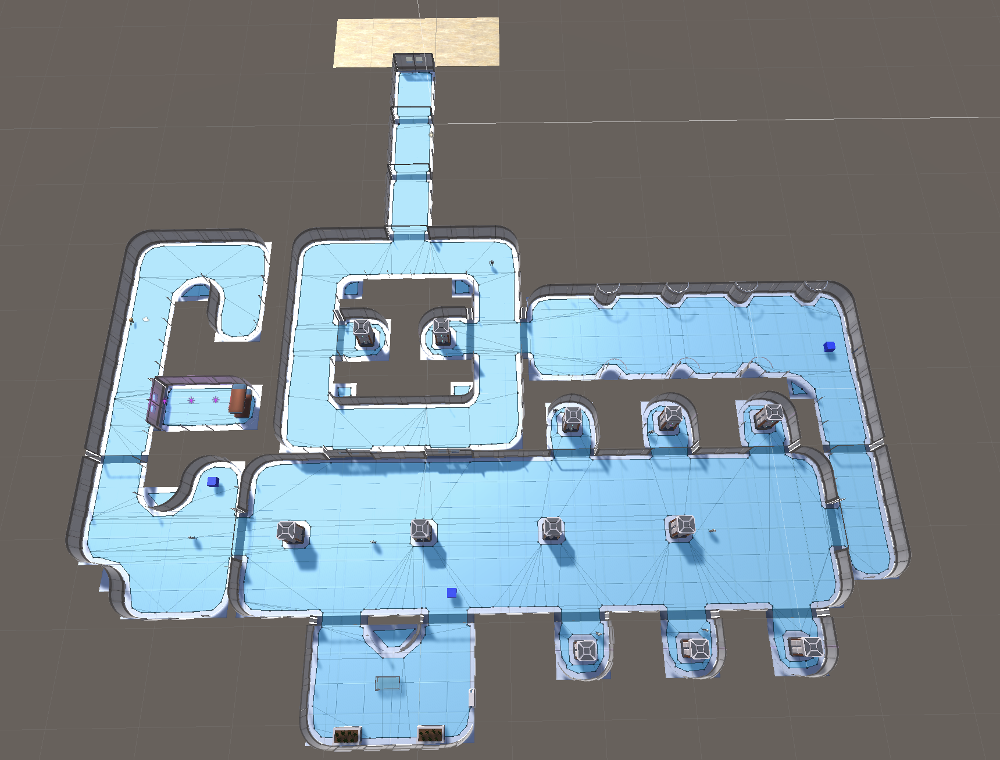
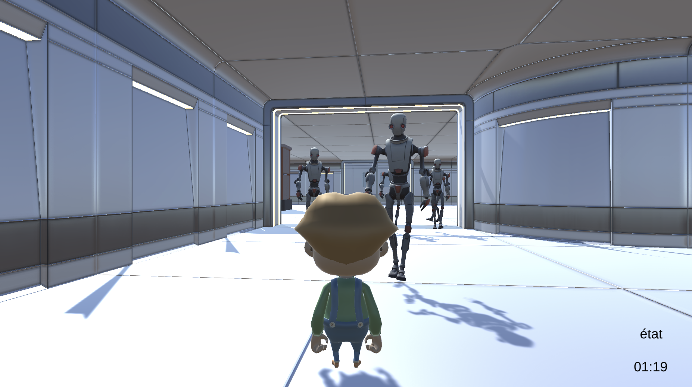
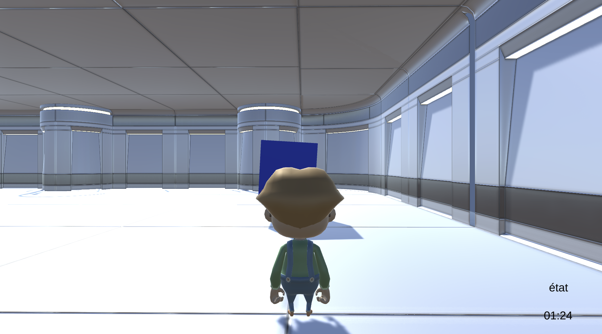
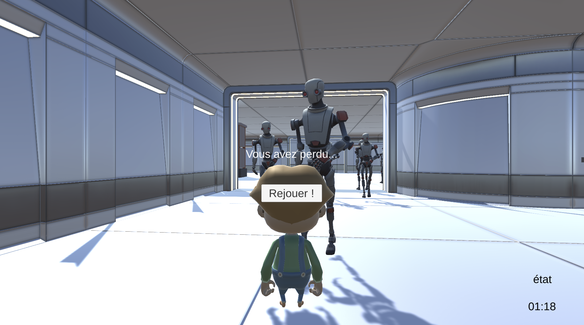

# Robot Pursuit

See [docs/ARCHITECTURE.md](docs/ARCHITECTURE.md) for an architecture diagram.

#### 🕵️‍♂️ **Escape from the Robot Complex**

A stealth-based 3D escape game developed in Unity.  
You play a prisoner attempting to escape a heavily-guarded robot complex in under 3 minutes without being detected or caught.

  

##### 🎮 **How to Play**

- Move Ferdinand using:

- W / S — Move forward and backward
- A / D — Rotate left and right

- Avoid all robots. If you're seen, all of them will chase you. If you're caught (touched), you lose.
- Escape through the main exit before the timer runs out!

⏳ Time limit: 3 minutes🧠 Tip: Stay out of the robots' line of sight!

  

#### 🧠 **Game Mechanics**

##### 👀 **Stealth & Detection**

- Ferdinand is **stealthy** by default.
- If any robot sees Ferdinand (based on a 25-unit distance and 80° vision cone) all robots pursue him.

##### 🤖 **Robot Types**

| **Type**       | **Behavior while stealthy** | **Behavior when detected** |
| -------------- | --------------------------- | -------------------------- |
| **Patrollers** | Follow a patrol route       | Chase Ferdinand            |
| **Hunters**    | Remain stationary           | Chase Ferdinand            |

If Ferdinand returns to stealth, hunters freeze and patrollers resume patrol.

##### 🧲 **Magnetic Cubes**

- 3 floating cubes are scattered in the level.
- Picking one up:

- Plays a sound
- Makes Ferdinand **undetectable** for 5 seconds
- Destroys the cube

  

#### 🏁 **Win/Lose Conditions**

|   |   |
|---|---|
|Condition|Result|
|Reaches exit door|🎉 Victory!|
|Gets caught by robot|❌ Game Over|
|Timer runs out|⏱️ Game Over|

After any ending, the player can **restart** the game.

#### 🧪 **Cheat Codes (Debug Keys)**

- Press T – Instantly teleport Ferdinand to the exit door

#### 🛠 **Technical Details**

- Built with **Unity 2022.3.17f1**
- Main components:

- CharacterController — for Ferdinand's movement
- NavMeshAgent — for robot pathfinding
- Custom GameManager — tracks game state, time, and detection
- Trigger zones — handle win/loss conditions
- Sound & animation controllers — for feedback and realism

  

### 📸 **Screenshots**

#### 🎬 **Opening Scene**

#### 🕹️ **Game Surface**

####  🤖 **Robot Chase**

#### 🧲 **Magnetic Cube**

#### 🚪 **Victory Scene**

#### 🚪 **Lost Scene**

  

#### 🙋‍♂️ **Credits**

- **Developer:** Octavian Mihai
- **Game Engine:** Unity 2022.3.17f1
