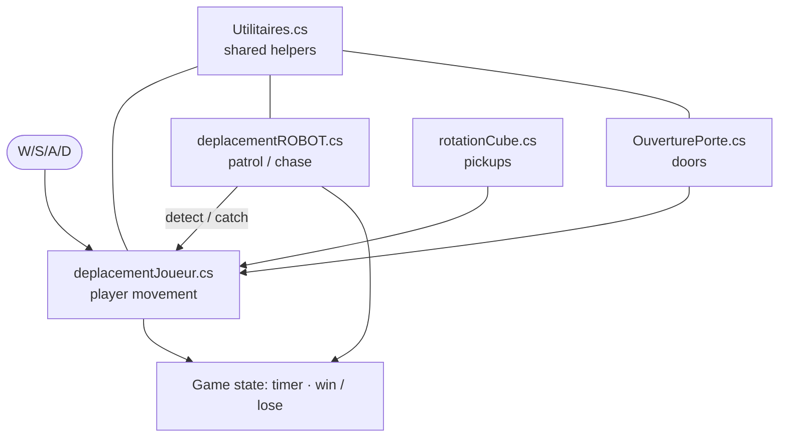

# Architecture

A Unity stealth/escape game: evade patrolling robots and reach the exit within 3 minutes.

```mermaid
flowchart TD
    Input([W/S/A/D]) --> PM["deplacementJoueur.cs<br/>player movement"]
    Robots["deplacementROBOT.cs<br/>patrol / chase"] -->|detect / catch| PM
    Door["OuverturePorte.cs<br/>doors"] --> PM
    Spin["rotationCube.cs<br/>pickups"] --> PM
    Util["Utilitaires.cs<br/>shared helpers"] --- PM & Robots & Door
    PM --> Game[Game state: timer · win / lose]
    Robots --> Game
```
